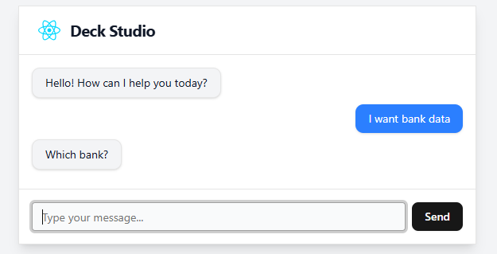

# React + TypeScript + Vite

A simple AI-powered onboarding chat where a user
describes what they want, and the system generates a Job Spec.



# Running the Project

```bash
# Run the backend
cd backend
dotnet watch run

# Run the frontend
cd frontend
npm install -g pnpm@latest-10
pnpm install
pnpm run dev

# Browse the app at http://127.0.0.1:5173
# Browse the swagger at http://127.0.0.1:5270/swagger/index.html
```
