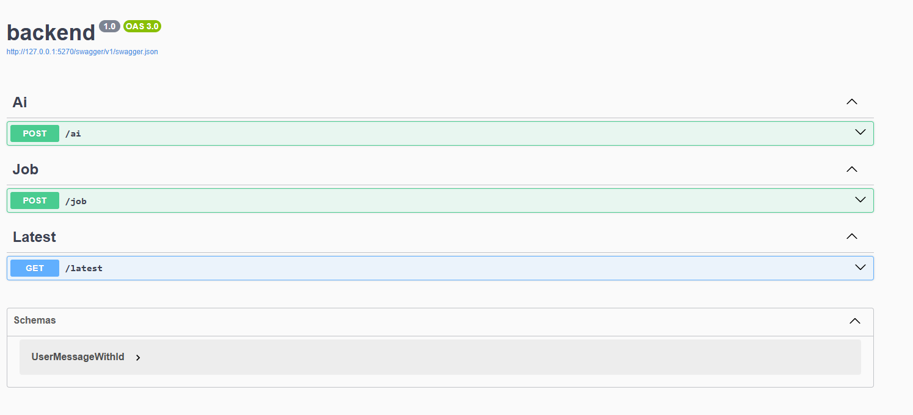

# Deck Studio Backend

## API Endpoints

### POST /ai
- Accepts: `{ "message": string, "id"?: string }`
- Returns a rule-based AI response and manages a multi-step conversation using a conversation ID.
- If no `id` is provided, a new one is generated and returned in the response.
- Returns: `{ response: string, jobSpec?: object, id: string }`
- Used for collecting user input and previewing a job spec before confirmation.

### POST /job
- Accepts: any JSON object representing a job spec (from the preview in the chat flow).
- Adds a `submitted_at` field (UTC datetime) to the job spec before storing it.
- Stores the job spec as the latest and in the job queue.
- Returns: `{ status: "Job Spec received" }`

### GET /latest
- Returns the most recently confirmed job spec as JSON (including the `submitted_at` field).
- If no job spec exists, returns 404.

## Code Structure

- `AiController.cs` - Acts as a state machine to manage a conversation with the AI.
- `JobController.cs` - Manages job specs and their submission.
- `LatestController.cs` - Returns the last job spec that submitted to JobController.


# Usage:

```sh
dotnet watch run # http://127.0.0.1:5270/swagger/index.html
```

